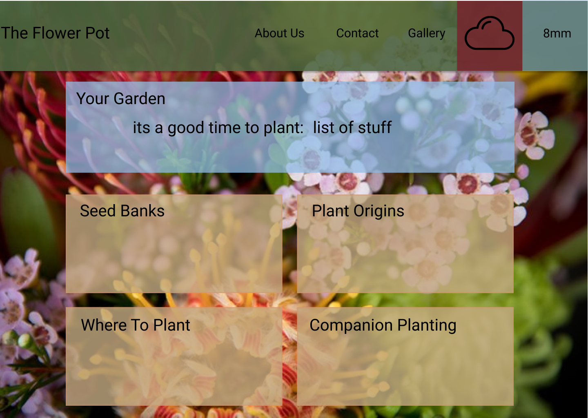

# FlowerPot

A website to take the growing pains out of learning how to garden.

FlowerPot provides a user friendly entry into the realm of gardening or a great place to expand your knowledge.
With information on how to plant, sun and soil preference, watering recommendations and weather information specific to your area to help you grow your garden.
Find seed banks and local sellers to buy your next plant, watering guides dependant on the rainfall in your area, the weather forcast to know when the hot days are coming and ways to give your plants extra TLC. Learn about the best locations to plant different species, companion planting and the benefits or look up the origins of different plants.

[FlowerPot](https://flowerpotpeople.github.io/FlowerPot/)

User story:
	As a new gardener
	I want to know when to water/plant/harvest my plant
	So that it thrives

MVP: Your Garden - 
  Provide user with information on how to grow, harvest and maintain plants.
  Save what you planted and the date to keep track of your plants growth.

## WireFrame
Our wireframe for FlowerPot features a navbar with a weather widget that shows the rainfall in millimeters for your area for the last 24hrs and the identifies the current weather with a simple icon. A hero tile that displays plants that are best planted at the current time of year and some basic information about them.
4 tiles that will link to other pages, displaying further information on each topic, a larger tile at the bottom of the page for Your Garden.

## Acknowledgements 

API's implemented:
* https://openweathermap.org/api
* https://developer.mozilla.org/en-US/docs/Web/API/Geolocation_API  
* http://harvesthelper.herokuapp.com/developers
Icons: 
* www.flaticon.com

### Application Requirements (project 1 Monash Full Stack Coding BootCamp):

- [x] Do not use Bootstrap as CSS framework
- [x] Be deployed to GitHub Pages
- [x] Be interactive (i.e., accept and respond to user input)
- [x] Use at least two server-side APIs
- [x] Do not use JS alerts, confirms or prompts (use modals instead)
- [x] Use client-side storage to store persistent data
- [x] Be responsive
- [x] Have a polished UI
- [x] Have a clean repository that meets quality coding standards
- [x] Have a quality README (with unique name, description, technologies used, screenshot, and link to deployed application)

### Presentation requirements (project 1 Monash Full Stack Coding BootCamp):

Use this [project presentation template](https://docs.google.com/presentation/d/1_u8TKy5zW5UlrVQVnyDEZ0unGI2tjQPDEpA0FNuBKAw/edit?usp=sharing) to address the following: 

- [x] Elevator pitch: a one minute description of your application

- [x] Concept: What is your user story? What was your motivation for development?

- [x] Process: What were the technologies used? How were tasks and roles broken down and assigned? What challenges did you encounter? What were your successes?

- [x] Demo: Show your stuff!

- [x] Directions for Future Development

- [x] Links to the deployed application and the GitHub repository

### Notes for Submission on BCS  

Each member is required to submit the following:

* The URL of the deployed application.

* The URL of the GitHub repository.

