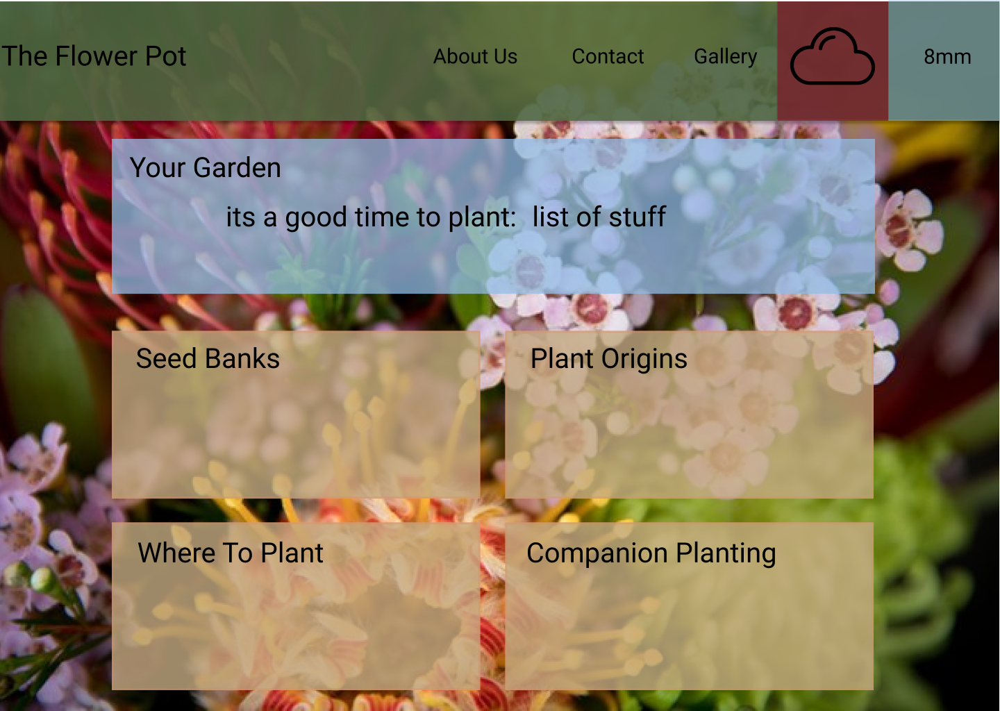

# FlowerPot

A website to take the growing pains out of learning how to garden.

Providing weather information specific to your area, watering recommendations and good plant options for the current time of year.

[FlowerPot](https://flowerpotpeople.github.io/FlowerPot/)

## WireFrame
Our wireframe for FlowerPot features a navbar with a weather widget that shows the rainfall in millimeters for your area for the last 24hrs and the identifies the current weather with a simple icon. A hero tile that displays plants that are best planted at the current time of year and some basic information about them.
4 tiles that will link to other pages, displaying further information on each topic.

## Acknowledgements 

API's implemented:
* https://openweathermap.org/api
* https://developer.mozilla.org/en-US/docs/Web/API/Geolocation_API
Icons:
* www.flaticon.com

### Application Requirements (project 1 Monash Full Stack Coding BootCamp):

- [] Use a CSS framework other than Bootstrap
- [x] Be deployed to GitHub Pages
- [] Be interactive (i.e., accept and respond to user input)
- [x] Use at least two server-side APIs
- [] Do not use alerts, confirms or prompts (use modals instead)
- [] Use client-side storage to store persistent data
- [] Be responsive
- [] Have a polished UI
- [] Have a clean repository that meets quality coding standards
- [] Have a quality README (with unique name, description, technologies used, screenshot, and link to deployed application)

### Presentation requirements (project 1 Monash Full Stack Coding BootCamp):

Use this [project presentation template](https://docs.google.com/presentation/d/1_u8TKy5zW5UlrVQVnyDEZ0unGI2tjQPDEpA0FNuBKAw/edit?usp=sharing) to address the following: 

- [] Elevator pitch: a one minute description of your application

- [] Concept: What is your user story? What was your motivation for development?

- [] Process: What were the technologies used? How were tasks and roles broken down and assigned? What challenges did you encounter? What were your successes?

- [] Demo: Show your stuff!

- [] Directions for Future Development

- [] Links to the deployed application and the GitHub repository

